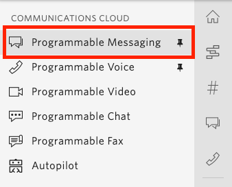

#  手順1: SMSを送信可能な国を確認、変更する 

この手順ではTwilioコンソールの使い方に慣れるとともに、SMSを送信できる国の設定を確認、変更します。

## 1-1: コンソールからProgrammable Messagingを開く

下記のスクリーンショットを参考に[Twilioコンソール](https://www.twilio.com/console)のメニューから[Programmable Messaging](https://www.twilio.com/console/sms/dashboard)を開きます。見つけられない場合は[この](https://www.twilio.com/console/sms/dashboard)のリンクから開いてください。

## 1-2: SMSを送信可能な国々を確認し、必要に応じて有効化する 

ミスや不正利用を防ぐためにSMSを送信可能な国が標準設定で制限されています。今回は米国の電話番号を用いて日本の番号にSMSを送信するため、この手順では日本への送信が可能となっていることを確認します。

Programmable Messagingの`Settings` - `Geo Permissions`を開きます。

Geo Permissionページは地域でグループ分けされており、送信可能な国のチェックボックスを`On`にすることで送信が可能になります。
`ASIA` - `Japan`のチェックボックスが`On`となっていることを確認してください。

これで日本へのSMS送信が有効化されました。

---

この設定が有効になっていない国にSMSを送信した場合は下記のエラーがTwilioから送信されます。

[Error 21408 - 'To'番号で指定された地域はSMSを送る許可が有効ではありません](https://jp.twilio.com/docs/api/errors/21408)

---

## 次の手順

次の手順ではSMSを送信するためのメッセージングサービスを作成し、送信元となる電話番号を取得します。

[手順2: メッセージングサービスを作成し、SMS送信可能な電話番号を取得する](02-try-it-out.md)