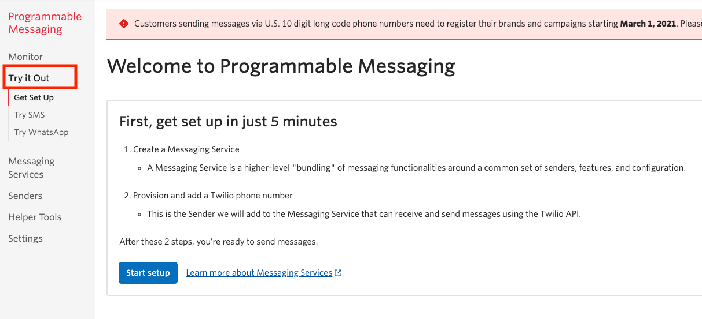
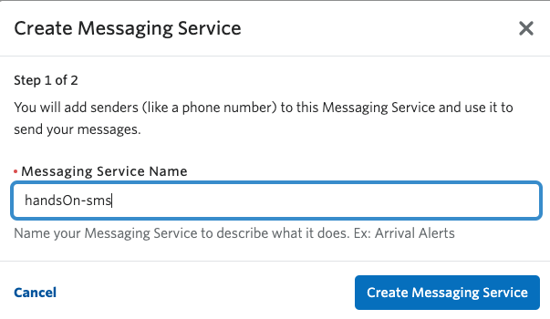
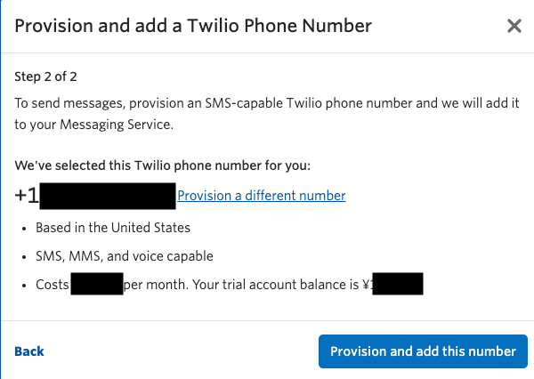
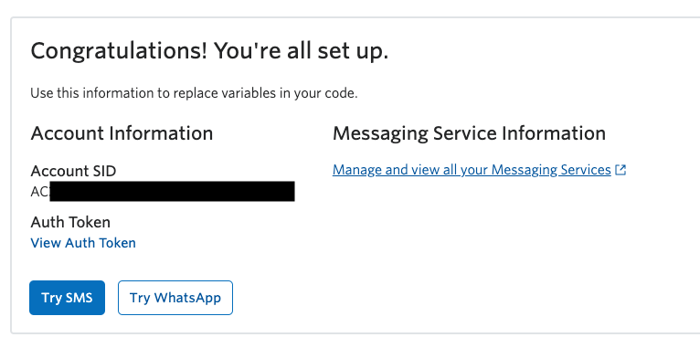

#  手順2: メッセージングサービスを作成し、SMS送信可能な電話番号を取得する

この手順ではSMSを送信するためのメッセージングサービスを作成し、送信元となる電話番号を取得します。

## 2-1: SMS送信を試す（Try it Out)

コンソールではTwilioを使ったSMS送信の初期設定を行い、指定する番号にテスト送信ができます。

Programmable Messagingコンソールから[Try it Out](https://www.twilio.com/console/sms/get-setup)を開きます。

Try it OutページからSMSを送信するためには次の設定が必要となります。

- メッセージングサービス（Messaging Service）の作成
- メッセージングサービスにSMSの送信元となる電話番号を割り当て

これらの設定するため、`Start setup`ボタンをクリックします。

## 2-2: メッセージングサービスの作成、または選択

初めてSMSを利用する場合、メッセージングサービスを作成する必要があります。

`Messaging Service Name`にわかりやすい名前をつけます。

既にメッセージングサービスを作成している場合はそちらを選択できます。

`Create Messaging Service`または`Select Messaging Service`ボタンをクリックし、電話番号の取得に移ります。

## 2-3: SMS送信可能な電話番号を取得

メッセージングサービスにはSMS送信可能な電話番号を最低1つ設定しなければいけません。

Twilio電話番号を保有していない場合、次の画面でSMS送信可能な電話番号を検索し、購入の許可を求めてきます。番号の詳細や月額の費用が記載されているので確認してください。

ここで`Provision and add this number`ボタンをクリックすると番号を購入できます。

既に番号を保有している場合はそちらから選択できます。

これでコンソールからSMSを送信する準備が整いました。

## 次の手順

次の手順ではコンソールからSMSを送信します。

[手順3: SMSを送信する](03-send-the-test-sms.md)