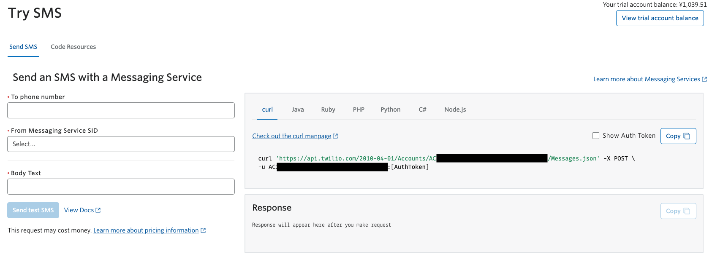
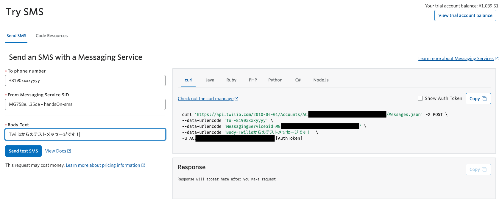
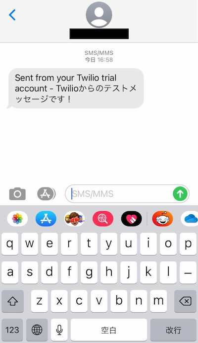

#  手順3: SMSを送信する

この手順ではコンソールからSMSを送信します。

## 3-1: SMSをテスト送信

続けて`Try SMS`ボタンをクリックするか[こちら](https://www.twilio.com/console/sms/getting-started/build)のリンクをクリックし、下記の画面を開きます。

`To phone number`にアカウントを作成した際、認証に利用した電話番号を[E.164フォーマット]()で入力します。`From Messaging Services SID`には先ほど作成したメッセージングサービスを選択します。最後に`Body Text`へテストメッセージを入力し、`Send test SMS`ボタンをクリックします。

## 3-2: 送信結果を確認

自分の端末でメッセージが届いていることを確認します。

----

トライアルアカウントを利用した場合はメッセージの冒頭に _Sent from your Twilio trial account -_ という文言が追加されます。トライアルアカウントには[さまざまな制限](https://support.twilio.com/hc/en-us/articles/360046044073-%E3%83%88%E3%83%A9%E3%82%A4%E3%82%A2%E3%83%AB%E3%82%A2%E3%82%AB%E3%82%A6%E3%83%B3%E3%83%88%E5%88%B6%E9%99%90%E4%BA%8B%E9%A0%85)が存在するため、全ての機能を利用する場合は下記の手順にしたがってアップレードを検討してください。

[Twilioアカウントにプロモコードを適用する方法](https://www.twilio.com/blog/how-to-apply-promo-code-ja) - プロモーションコードはTwilioが主催する、あるいはスポンサーとなるイベントで配布されることがあります。

### Programmable Messagingにおけるトライアルアカウントの制限

- 検証済みの電話番号のみにメッセージが送信できます。また、検証済みの番号からのみ返信が可能です。一部の送信（高額な番号へのメッセージ）は無効となっています。
- 送信元の番号はSMS送信が可能なTwilio番号のみです。アップグレード後もこの仕様は継続されます。
- Twilioのトライアルアカウントから送信された旨を示す文言がメッセージに追加されます。
- 英数字送信者IDは利用できません。
- 別のTwilioプロジェクトに対してSMSを送信できません。

----

おめでとうございます。TwilioからSMSを送信できました。

## 次のハンズオン

次のハンズオンではアプリケーションからSMSを送信するA2P（Application-to-person）メッセージングを実現する方法について学習します。

[ハンズオン: アプリケーションからSMSを送信](../02-Send-SMS-from-application/00-Overview.md)