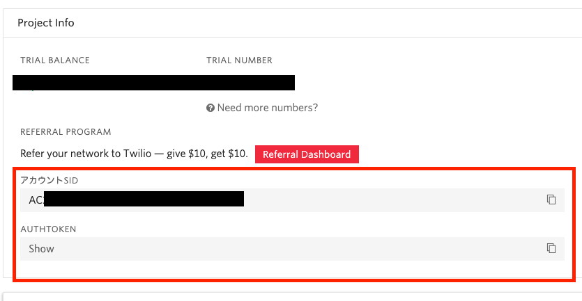
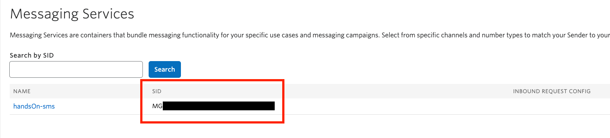

#  手順1: Twilio RESTヘルパーライブラリの導入と準備 

この手順ではTwilio REST APIにアクセスするヘルパーライブラリをインストールし、Twilioクライアントを利用するために資格情報を設定します。

なお、この手順でインストールするパッケージはサーバーアプリケーションでの利用を前提としています。フロントエンド側のプロジェクトには追加しないでください。

## 1-1: サンプルプロジェクトをクローン

ターミナル、またはコマンドプロンプトで次のコマンドを実行し、サンプルプロジェクトをクローンします。`Git`がインストールされていない場合は、[リポジトリ](https://github.com/neri78/Twilio-HandsOn-Messaging-SampleApp-JP.git)の`Code`ボタンから直接Zipファイルをダウンロードし展開してください。

```zsh
git clone https://github.com/neri78/Twilio-HandsOn-Messaging-SampleApp-JP.git
```

クローンあるいは展開が完了したのち、プロジェクトフォルダに移動し次のコマンドで依存パッケージをインストールします。

```zsh
cd Twilio-HandsOn-Messaging-SampleApp-JP
npm install
```

依存パッケージのインストールが完了した状態でプロジェクトをコードエディタで開きます。

なお、コードエディタであらかじめプロジェクトを開いた状態で依存パッケージをインストールしても構いません。

## 1-2: Twilio資格情報、電話番号を.envファイルに記録

プロジェクトには`.env.sample`というファイルが存在します。このファイルを`.env`とリネームするか、コピーし名前を修正します。

このファイルには次の環境変数が空のまま定義されています。

```zsh
TWILIO_ACCOUNT_SID=
TWILIO_AUTH_TOKEN=
TWILIO_MESSAGING_SERVICE_SID=
MY_PHONE_NUMBER=
```

次に[コンソール](https://jp.twilio.com/console)を開きます。この画面のProject Infoに表示されている`アカウントSID`、`AUTHTOKEN`の値をそれぞれ、`TWILIO_ACCOUNT_SID`、`TWILIO_AUTH_TOKEN`に転記します。これらは非常に重要な情報であるため、外部への漏洩や誤って公開しないように十分ご注意ください。



次に先ほど作成した`Messaging Service`の`SID`を`TWILIO_MESSAGING_SERVICE_SID`に設定します。Messaging Service Sidは[こちら](https://jp.twilio.com/console/sms/services)で確認できます。



最後にTwilioアカウントの登録時に確認コードを受け取った電話番号を[E.164フォーマット](https://jp.twilio.com/docs/glossary/what-e164)に変換し`MY_PHONE_NUMBER`へ設定します。日本番号の場合は国番号（+81）をつけ、最初のゼロ（0）を取り除きます。

## 1-3: twilio-nodeヘルパーライブラリをインストール

Twilio REST APIをNode.jsで簡単に利用できる`twilio-node`ヘルパーライブラリを次のコマンドでインストールします。

```zsh
npm i twilio
```
これで次の手順からヘルパーライブラリを使う準備ができました。

## 次の手順

[手順2: アプリケーションからSMSを送信](02-Send-SMS.md)
