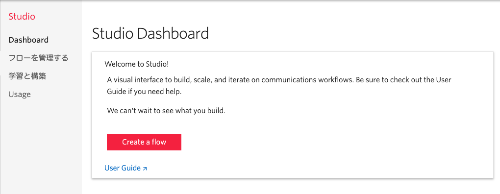
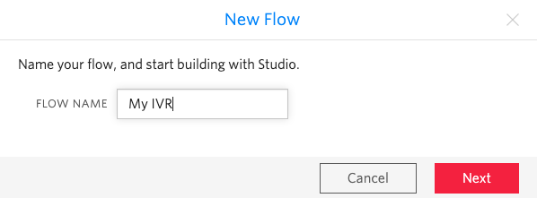
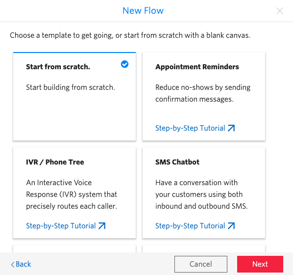
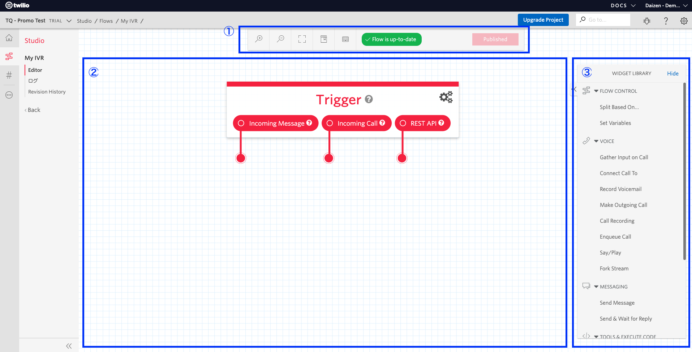

#  手順1: 新しいコールフローの作成

この手順では、Twilio Studioを用いて新しいフローを作成する方法を学びます。

## 1-1. Studioフローの新規作成

初めてフローを作成する場合、[Studioダッシュボード](https://jp.twilio.com/console/studio/dashboard)ページの`Create a flow`ボタンをクリックします。以前に作成したことがある場合は既存のフロー一覧が表示されている状態で`+`ボタンをクリックします。

最初に任意の名前を設定します。

いくつかテンプレートが表示されますが、このハンズオンでは`Start from scratch`を選択します。

初期化が完了するとデザイン画面が表示されます。デザイン画面には大きく分けて3つの領域が用意されています。

|領域の番号 |説明 |
|:-------:|:--------|
|1|デザインキャンバスの操作およびフローの公開を制御|
|2|デザインキャンバス、ここにウィジェットを配置する |
|3|ウィジェットライブラリ、アクションやフロー制御を行う __部品__ が準備されている |

これらを利用しフローを作成します。

## 次の手順

次の手順ではあらかじめ実装されているフローを復元し、Twilio番号に接続します。

[コールフローを復元し、電話番号に接続](02-Load-Flow.md)
