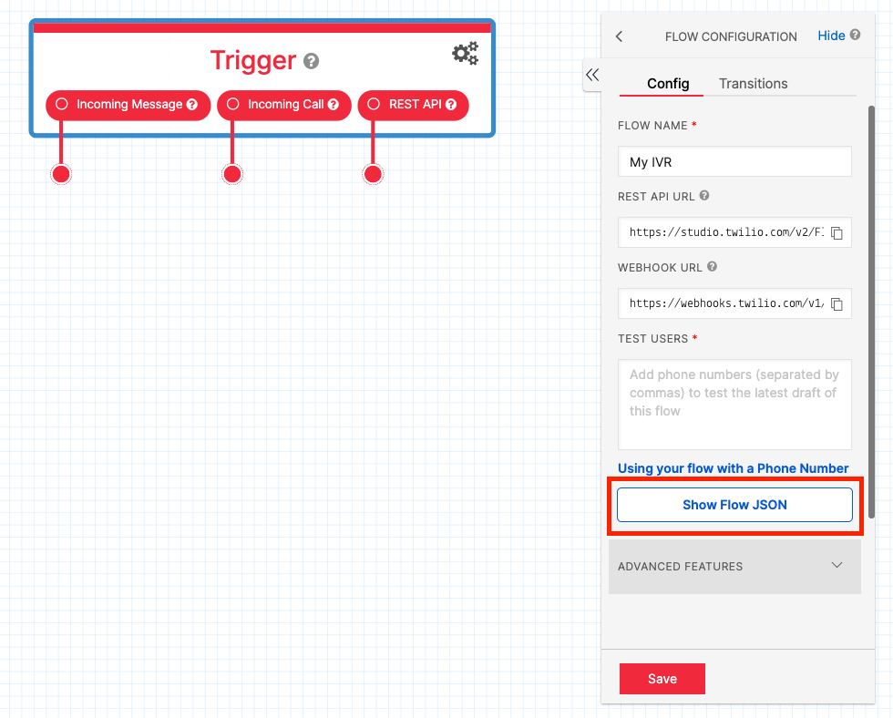
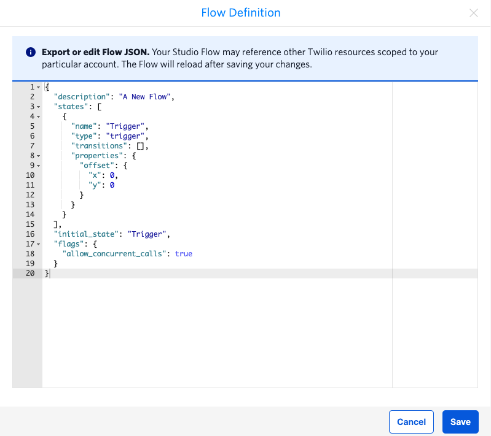
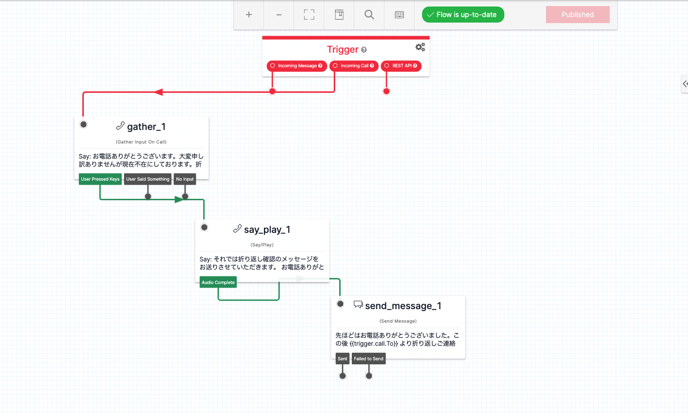
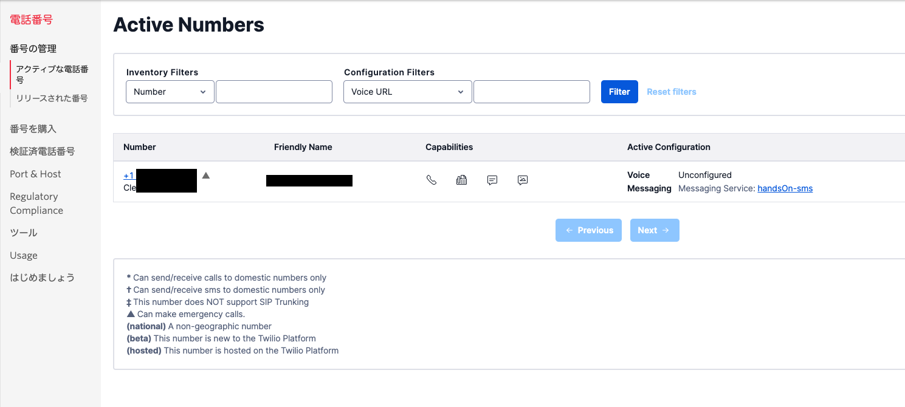
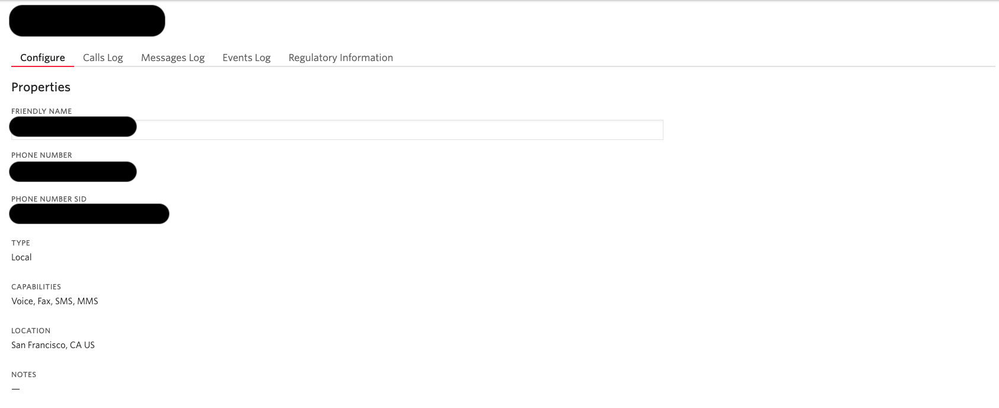
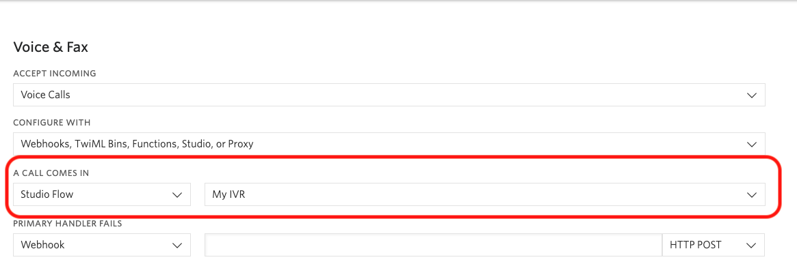

#  手順2: コールフローを復元し、電話番号に接続

この手順ではあらかじめ実装されているフローを復元し、Twilio番号に接続します。

## 1-1: コールフローを復元 

先ほど作成したフローの`Trigger`を選択状態とし、右のパネルから`Show Flow JSON`ボタンをクリックします。

Flow Definitionダイアログが開きます。このダイアログにはフローの定義情報がJSONフォーマットで表示されており、コピーしたり、別のフロー定義をペーストできます。

このダイアログに[こちら](../data/flow.json)からダウンロードできる`flow.json`の内容をペーストします。

`Save`ボタンをクリックするとペーストした内容がStudioのデザイン画面に反映されます。

このフローは電話着信があった際に指定のテキストを再生し、折り返しのメッセージを送信します。

この状態で、右上の`Publish`ボタンが活性化している場合はクリックし、最新の状態に更新してください。

## 1-2: フローを電話番号に接続

[電話番号コンソール](https://www.twilio.com/console/phone-numbers/incoming)を開き、今回購入した番号をクリックします。

番号設定画面が表示されます。

この画面をスクロールし、`Voice & Fax`セクションの`A CALL COMES IN`項目を設定します。
最初のドロップダウンで`Studio Flow`を選択し、次のドロップダウンで先ほど作成したフローを選択します。

忘れずに`Save`ボタンをクリックしましょう。よく忘れがちな手順です。

## 1-3. Let's Test

それではこの番号に電話をかけてみましょう。トライアルアカウントを利用している場合は、最初に英語で下記のトライアルアカウントである旨を知らせるメッセージが流れます。このメッセージはスキップできないので最後まで聴いてください。

> *You have a trial account. You can remove this message at anytime by upgrading to full account. Press any to execute your code.*

メッセージの再生後に何かキーを押すとフローが開始されます。案内にしたがってボタンを押すと、SMSが届きます。

このようにTwilio Programmable Messagingを利用するとほんの数行のコードでSMSを送信できます。また、Twilio Studioと連携することで音声応答と連動し、追加情報をSMSで送信できます。